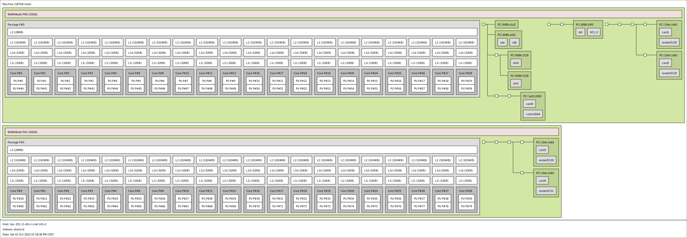
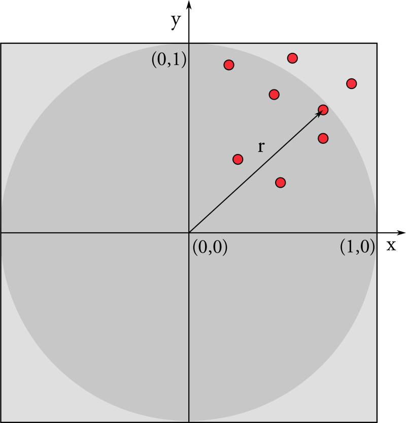

### Environment

```bash
module load compilers/gcc-9.2.0_sl7
```

### Topology of the machine
You can have a look at the topology of the machine you are running on with some tools:

```bash
[fpantaleohpc@hpc-201-11-40 ~]$ lscpu
Architecture:          x86_64
CPU op-mode(s):        32-bit, 64-bit
Byte Order:            Little Endian
CPU(s):                80
On-line CPU(s) list:   0-79
Thread(s) per core:    2
Core(s) per socket:    20
Socket(s):             2
NUMA node(s):          2
Vendor ID:             GenuineIntel
CPU family:            6
Model:                 85
Model name:            Intel(R) Xeon(R) Gold 6148 CPU @ 2.40GHz
Stepping:              4
CPU MHz:               999.902
CPU max MHz:           3700.0000
CPU min MHz:           1000.0000
BogoMIPS:              4800.00
Virtualization:        VT-x
L1d cache:             32K
L1i cache:             32K
L2 cache:              1024K
L3 cache:              28160K
NUMA node0 CPU(s):     0-19,40-59
NUMA node1 CPU(s):     20-39,60-79
Flags:                 fpu vme de pse tsc msr pae mce cx8 apic sep mtrr pge mca cmov pat pse36 clflush dts acpi mmx fxsr sse sse2 ss ht tm pbe syscall nx pdpe1gb rdtscp lm constant_tsc art arch_perfmon pebs bts rep_good nopl xtopology nonstop_tsc aperfmperf eagerfpu pni pclmulqdq dtes64 monitor ds_cpl vmx smx est tm2 ssse3 sdbg fma cx16 xtpr pdcm pcid dca sse4_1 sse4_2 x2apic movbe popcnt tsc_deadline_timer aes xsave avx f16c rdrand lahf_lm abm 3dnowprefetch epb cat_l3 cdp_l3 invpcid_single intel_ppin intel_pt ssbd mba ibrs ibpb stibp tpr_shadow vnmi flexpriority ept vpid fsgsbase tsc_adjust bmi1 hle avx2 smep bmi2 erms invpcid rtm cqm mpx rdt_a avx512f avx512dq rdseed adx smap clflushopt clwb avx512cd avx512bw avx512vl xsaveopt xsavec xgetbv1 cqm_llc cqm_occup_llc cqm_mbm_total cqm_mbm_local dtherm ida arat pln pts pku ospke spec_ctrl intel_stibp flush_l1d

```

```bash
lstopo --output-format png > lstopo.png
```


```bash
[fpantaleohpc@hpc-201-11-40 ~]$ gcc -march=native -Q --help=target | grep march | awk '{ print $2 }'
skylake-avx512
valid

```

```bash
[fpantaleohpc@hpc-201-11-40 ~]$ numactl -H
available: 2 nodes (0-1)
node 0 cpus: 0 1 2 3 4 5 6 7 8 9 10 11 12 13 14 15 16 17 18 19 40 41 42 43 44 45 46 47 48 49 50 51 52 53 54 55 56 57 58 59
node 0 size: 95158 MB
node 0 free: 56225 MB
node 1 cpus: 20 21 22 23 24 25 26 27 28 29 30 31 32 33 34 35 36 37 38 39 60 61 62 63 64 65 66 67 68 69 70 71 72 73 74 75 76 77 78 79
node 1 size: 96753 MB
node 1 free: 91281 MB
node distances:
node   0   1 
  0:  10  21 
  1:  21  10 
```


### Automatic Vectorization

```C++
#pragma GCC optimize("O2", "unroll-loops", "omit-frame-pointer", "inline",     \
                     "tree-vectorize") // Optimization flags
#pragma GCC option("arch=native", "tune=native", "no-zero-upper") // Enable AVX
#pragma GCC target("avx")                                         // Enable AVX
#include <chrono>
#include <iostream>
#include <vector>

int main() {
  const int N = 200000;     // Array Size
  const int nTests = 20000; // Number of tests
  std::vector<float> a(N), b(N), c(N), result(N);
  auto now = std::chrono::high_resolution_clock::now();
  for (int i = 0; i < N; ++i) // Data initialization
  {
    a[i] = ((float)i) + 12.2f;
    b[i] = -21.50f * ((float)i) + 0.9383f;
    c[i] = 120.33f * ((float)i) + 9.1172f;
  }
  for (int i = 0; i < nTests; ++i) {
    for (int j = 0; j < N; ++j) {
      result[j] = a[j] - b[j] + c[j] + 42 * (float)i;
    }
  }
  auto end_time = std::chrono::duration_cast<std::chrono::duration<double>>(
                      std::chrono::high_resolution_clock::now() - now)
                      .count();
  std::cout << "Time spent: " << end_time << "s" << std::endl;
  return 0;
}
```

Compile with:
```
g++ vectorization.cpp -fopt-info-vec-optimized -o vectorization
./vectorization
```

Try removing `tree-vectorize` or replacing `O2` with `O3`.
Play with the loops to understand what breaks it.


### Hello World
```C++
#include <thread>
#include <iostream>
int main()
{
   auto f = [](int i){
   std::cout << "hello world from thread " << i << std::endl;
  };
//Construct a thread which runs the function f
  std::thread t0(f,0);

//and then destroy it by joining it
  t0.join();
}
```

Compile with:
```bash
g++ std_threads.cpp -lpthread -o std_threads
```


### Measuring time intervals
```C++
#include <chrono>
...
auto start = std::chrono::steady_clock::now();
  foo();
auto stop = std::chrono::steady_clock::now();
std::chrono::duration<double> dur= stop - start;
std::cout << dur.count() << " seconds" << std::endl;
```
### Exercise 1. Reduction

```C++
#include <iostream>
#include <random>
#include <utility>
#include <vector>
#include <chrono>

int main(){

  const unsigned int numElements= 100000000;   

  std::vector<int> input;
  input.reserve(numElements);

  std::mt19937 engine;
  std::uniform_int_distribution<> uniformDist(-5,5);
  for ( unsigned int i=0 ; i< numElements ; ++i) input.emplace_back(uniformDist(engine));

  long long int sum= 0;

  auto f= [&](unsigned long long firstIndex, unsigned long long lastIndex){
    for (auto it= firstIndex; it < lastIndex; ++it){
        sum+= input[it];
    }
  };

  auto start = std::chrono::system_clock::now();
  f(0,numElements);
  std::chrono::duration<double> dur= std::chrono::system_clock::now() - start;
  std::cout << "Time spent in reduction: " << dur.count() << " seconds" << std::endl;
  std::cout << "Sum result: " << sum << std::endl;
  return 0;
}
```

### Quickly create threads
```C++
unsigned int n = std::thread::hardware_concurrency();
std::vector<std::thread> v;
for (int i = 0; i < n; ++i) {
     v.emplace_back(f,i);
}
for (auto& t : v) {
    t.join();
}
```

### Exercise 2. Numerical Integration
```C++
#include <iostream>
#include <iomanip>
#include <chrono>

int main()
{
  double sum = 0.;
  constexpr unsigned int num_steps = 1 << 22;
  double pi = 0.0;
  constexpr double step = 1.0/(double) num_steps;
  auto start = std::chrono::system_clock::now();
  for (int i=0; i< num_steps; i++){
    auto  x = (i+0.5)/num_steps;
    sum = sum + 4.0/(1.0+x*x);
  }
  auto stop = std::chrono::system_clock::now();
  std::chrono::duration<double> dur= stop - start;
  std::cout << dur.count() << " seconds" << std::endl;
  pi = step * sum;

  std::cout << "result: " <<  std::setprecision (15) << pi << std::endl;
}

```


### Exercise 3. pi with Montecarlo

.

The area of the circle is pi and the area of the square is 4.

Generate `N` random floats `x` and `y` between `-1` and `1` [https://en.cppreference.com/w/cpp/numeric/random/uniform_real_distribution](https://en.cppreference.com/w/cpp/numeric/random/uniform_real_distribution).

Calculate the distance `r` of your point from the origin.

If `r < 1`: the point is inside the circle and increase `Nin`.

The ratio between `Nin` and `N` converges to the ratio between the areas.


### Setting the environment for Intel oneTBB

Download and extract the latest release for Intel oneTBB:
```bash
wget https://github.com/oneapi-src/oneTBB/releases/download/v2021.6.0/oneapi-tbb-2021.6.0-lin.tgz
tar -xzf oneapi-tbb-2021.6.0-lin.tgz
```
Let's now set the environment to use this version of oneTBB.
```bash
module load compilers/gcc-9.2.0_sl7
source oneapi-tbb-2021.6.0/env/vars.sh intel64 linux auto_tbbroot
echo $TBBROOT
```

To compile and link:
```bash
g++ -O2 algo_par.cpp  -ltbb
```
Let's check that you can compile a simple tbb program:

```C++
#include <cassert>
#include <cstdint>
#include <iostream>
#include <oneapi/tbb.h>
#include <oneapi/tbb/info.h>
#include <oneapi/tbb/parallel_for.h>
#include <oneapi/tbb/task_arena.h>

int main() {
  // Get the default number of threads
  int num_threads = oneapi::tbb::info::default_concurrency();
  int N = 20;
  std::cout << "Use indices: " << std::endl;
  // Run the default parallelism
  oneapi::tbb::parallel_for(0, N, [=](int i) {
    std::cout << "i= " << i << std::endl;
    std::cout << "number of threads: "
              << oneapi::tbb::this_task_arena::max_concurrency() << std::endl;
  });

  // Run the default parallelism
  std::cout << "\n\n\nNow use oneapi::tbb::blocked_range" << std::endl;
  oneapi::tbb::parallel_for(
      oneapi::tbb::blocked_range<size_t>(0, N), [=](auto &r) {
        for (auto i = r.begin(); i < r.end(); ++i) {
          std::cout << "i= " << i << std::endl;
        }
        std::cout << "number of threads: "
                  << oneapi::tbb::this_task_arena::max_concurrency()
                  << std::endl;
      });

  // Create the task_arena with 3 threads
  std::cout << "\n\n\nNow use a task_arena with 3 threads" << std::endl;
  oneapi::tbb::task_arena arena(3);
  arena.execute([=] {
    oneapi::tbb::parallel_for(
        oneapi::tbb::blocked_range<size_t>(0, N),
        [=](const oneapi::tbb::blocked_range<size_t> &r) {
          for (auto i = r.begin(); i < r.end(); ++i) {

            std::cout << "i= " << i << std::endl;
          }
          std::cout << "Number of threads in the task_arena: "
                    << oneapi::tbb::this_task_arena::max_concurrency()
                    << std::endl;
        });
  });

  return 0;
}

```


Compile with:
```bash
g++ your_first_tbb_program.cpp -ltbb 
```

### Your TBB Thread pool
```C++
// analogous to hardware_concurrency, number of hw threads:
int num_threads = oneapi::tbb::info::default_concurrency();

// or if you wish to force a number of threads:
auto t = 10; //running with 10 threads
oneapi::tbb::task_arena arena(t);

// And query an arena for the number of threads used:
auto max = oneapi::tbb::this_task_arena::max_concurrency();
// Limit the number of threads to two for all oneTBB parallel interfaces
oneapi::tbb::global_control global_limit(oneapi::tbb::global_control::max_allowed_parallelism, 2);
```

### Task parallelism

A task is submitted to a task_group as in the following.
The `run` method is asynchronous. In order to be sure that the task has completed, the `wait` method has to be launched.
Alternatively, the `run_and_wait` method can be used.


```C++
#include <iostream>
#include <oneapi/tbb.h>
#include <oneapi/tbb/task_group.h>

using namespace oneapi::tbb;

int Fib(int n) {
  if (n < 2) {
    return n;
  } else {
    int x, y;
    task_group g;
    g.run([&] { x = Fib(n - 1); }); // spawn a task
    g.run([&] { y = Fib(n - 2); }); // spawn another task
    g.wait();                       // wait for both tasks to complete
    return x + y;
  }
}

int main() {
  std::cout << Fib(32) << std::endl;
  return 0;
}
```
